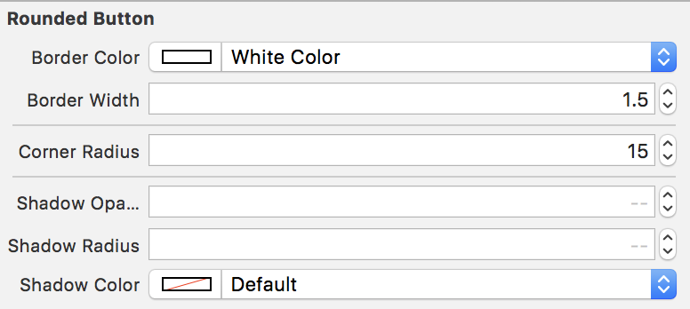
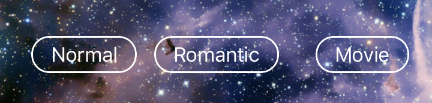

# RoundedAndShadowButton
Swift UIButton setting Rounded and Shadow using IBInspectable

it is **make easy** UIButton rounded or shadow

@IBInspectable list
* borderColor (UIColor)
* borderWidth (CGFloat)
* cornerRadius (CGFloat)

* shadowOpacity (Float)
* shadowRadius (CGFloat)
* shadowColor (UIColor)

---
you can make rounded UIButton from StoryBoard!

inspector

you can see this in storyBoard

you can see this in Build
  
  > because I wrote this code `contentEdgeInsets = UIEdgeInsetsMake(5, 16, 5, 16)`

